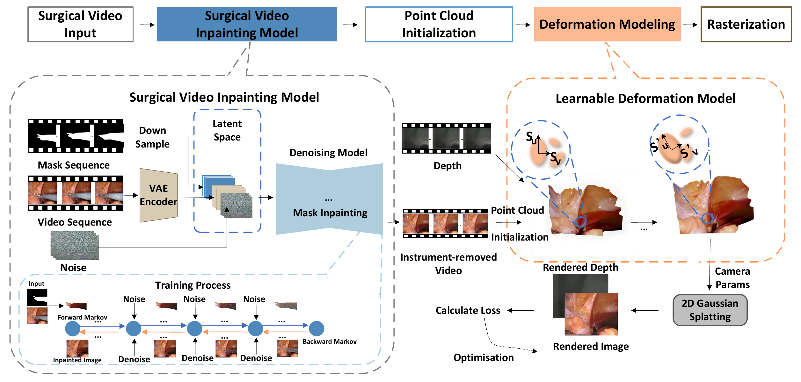

# Diff2DGS

Official implementation of **Diff2DGS: Reliable Reconstruction of Occluded Surgical Scenes via 2D Gaussian Splatting(IEEE RA-L)**.

Diff2DGS restores tissue hidden by surgical instruments and reconstructs the resulting dynamic scene with deformable 2D Gaussian surfels. This repository provides the complete pipeline, including frame/video conversion, mask-aware video inpainting, dataset assembly, training, rendering, evaluation, and optional point-cloud export.

[](assets/miccai_fig.pdf)

## Installation

The tested configuration is Ubuntu 22.04, Python 3.9, CUDA 11.8, and PyTorch 2.1.2. An NVIDIA GPU with at least 24 GB is recommended for the default 960-pixel inpainting resolution.

### Docker

```bash
git clone https://github.com/styufo/Diff2DGS.git
cd Diff2DGS
docker build -t diff2dgs:cuda118 .
```

Run the container with the dataset, workspace, and weights mounted explicitly:

```bash
docker run --rm --gpus all \
  -v /path/to/scene:/data:ro \
  -v /path/to/run:/run \
  -v /path/to/weights:/weights:ro \
  diff2dgs:cuda118 run \
  --data /data --workspace /run --weights /weights --export-ply
```

### Conda

```bash
git clone https://github.com/styufo/Diff2DGS.git
cd Diff2DGS
bash scripts/setup_env.sh
conda activate diff2dgs
```

The setup script installs the Python package and compiles `simple-knn` and the 2D Gaussian surfel rasterizer locally. Compiled binaries are intentionally not stored in Git.

Run the CPU-only orchestration tests with `python -m unittest discover -s tests`.

## Model Weights

Download the standard model components with:

```bash
bash scripts/download_weights.sh
```

The Diff2DGS inpainting checkpoint is distributed separately. Download it from the [project checkpoint folder](https://drive.google.com/drive/folders/1TZPRpgjMtV274dyqo3XBy_0PB93upHSy?usp=sharing) and arrange the files as:

```text
weights/
  diffinpaint/
    brushnet/
    unet_main/
  stable-diffusion-v1-5/
  sd-vae-ft-mse/
  PCM_Weights/sd15/
  propainter/
    ProPainter.pth
    raft-things.pth
    recurrent_flow_completion.pth
```

Weights, datasets, and generated outputs are ignored by Git.

## Data

The one-command pipeline accepts the EndoNeRF-compatible layout used by both EndoNeRF and our preprocessed StereoMIS clips:

```text
scene/
  images/
  masks/
  depth/
  poses_bounds.npy
```

The three frame directories must contain the same number of frames. Files are matched by natural sorted order, so their prefixes may differ. Video inpainting requires at least 22 frames. Masks passed to the inpainting model must use white for the region to remove. Use `--mask-foreground black` when the supplied masks use the opposite convention.

The camera convention is detected automatically from common path and filename patterns. Use `--dataset-type endonerf` or `--dataset-type stereomis` to override detection for renamed datasets.

EndoNeRF can be obtained from its [official repository](https://github.com/med-air/EndoNeRF). StereoMIS must first be rectified and converted to this layout following [Deform3DGS](https://github.com/jinlab-imvr/Deform3DGS); stereo depth is expected to be present before running Diff2DGS.

## One-Command Reconstruction

```bash
diff2dgs run \
  --data /path/to/cutting_tissues_twice \
  --workspace runs/endonerf_cutting \
  --weights weights \
  --gpu 0 \
  --export-ply
```

The same command works for a converted StereoMIS scene:

```bash
diff2dgs run \
  --data /path/to/StereoMIS/P3 \
  --workspace runs/stereomis_p3 \
  --weights weights \
  --gpu 0
```

The default reconstruction uses the paper's conservative adaptive depth weighting:

```text
w_init = 10, alpha = 0.8, beta = 0.25, w_min = 1, w_max = 10
```

Useful controls:

```bash
# Stop after creating and validating the input videos.
diff2dgs run --data DATA --workspace RUN --to-stage prepare

# Resume at reconstruction after an interrupted inpainting run.
diff2dgs run --data DATA --workspace RUN --from-stage inpaint

# Rerun a completed stage and invalidate its dependent downstream stages.
diff2dgs run --data DATA --workspace RUN --force render

# Reconstruct images that have already been inpainted.
diff2dgs run --data INPAINTED_DATA --workspace RUN --skip-inpainting

# Fixed-weight ablation.
diff2dgs run --data DATA --workspace RUN --depth-strategy fixed --depth-weight 1
```

The workspace is organized as:

```text
runs/<name>/
  dataset/              # reconstruction-ready scene
  media/                # input, mask, prior, and inpainted videos
  model/                # checkpoints, renders, and results.json
    reconstruct/video/  # per-frame full-sequence PLY files (with --export-ply)
  dataset_manifest.json
  pipeline_state.json
```

On a desktop with an OpenGL display, play the exported PLY sequence or record it to a video with:

```bash
diff2dgs visualize \
  --input runs/endonerf_cutting/model/reconstruct/video \
  --fps 10 \
  --output runs/endonerf_cutting/point_cloud.mp4
```

## Components and Attribution

The inpainting implementation builds on [DiffuEraser](https://github.com/lixiaowen-xw/DiffuEraser) and uses [ProPainter](https://github.com/sczhou/ProPainter) to generate the temporal prior. The reconstruction implementation builds on [Deform3DGS](https://github.com/jinlab-imvr/Deform3DGS), [2D Gaussian Splatting](https://github.com/hbb1/2d-gaussian-splatting), and the Gaussian Splatting codebase. See [NOTICE](NOTICE.md) and the component license files before redistribution or commercial use.

## Citation

```bibtex
@article{song2026diff2dgs,
  title={Diff2DGS: Reliable Reconstruction of Occluded Surgical Scenes via 2D Gaussian Splatting},
  author={Song, Tianyi and Stoyanov, Danail and Mazomenos, Evangelos and Vasconcelos, Francisco},
  journal={IEEE Robotics and Automation Letters},
  year={2026}
}
```

Please also cite DiffuEraser, ProPainter, Deform3DGS, and 2D Gaussian Splatting when using the corresponding components.

## License

The repository contains components under different licenses. The reconstruction code is restricted to non-commercial research and evaluation under the Gaussian Splatting license in [LICENSE](LICENSE). The inpainting component is based on Apache-2.0 code, while ProPainter has its own terms. See [NOTICE](NOTICE.md) for the exact mapping.
